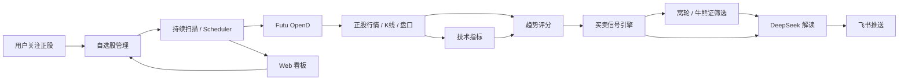
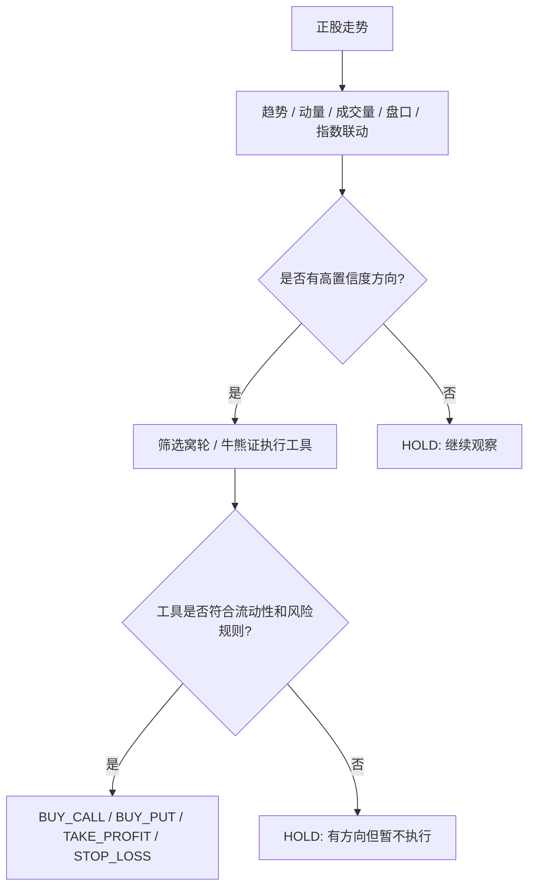
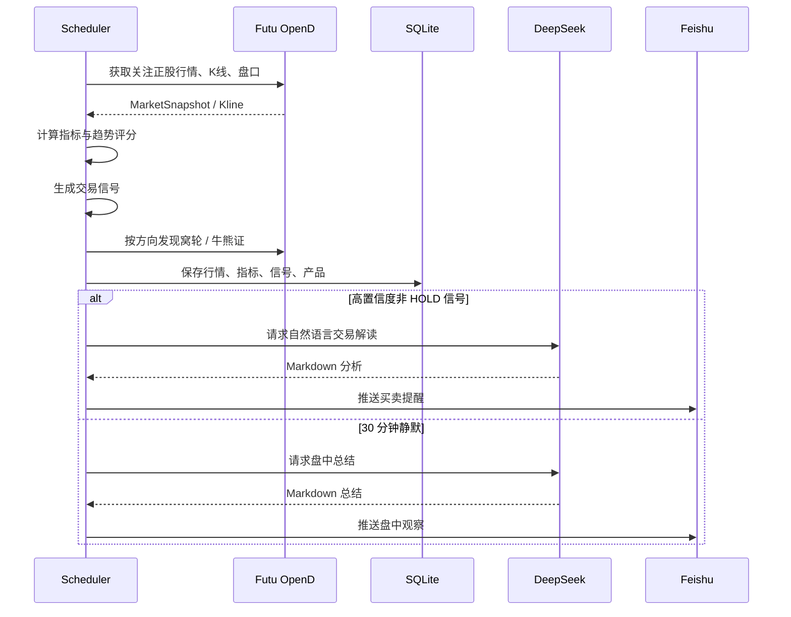

# HK Warrant Monitor

<p align="center">
  <strong>港股窝轮 / 牛熊证 AI 交易辅助系统</strong>
</p>

<p align="center">
  以正股趋势为判断核心，以窝轮和牛熊证作为执行工具，面向个人投资者的本地化盘中监控助手。
</p>

<p align="center">
  
  
  
  
  
</p>

> 本项目只做行情监控、信号分析、风险提示和消息推送，不自动交易，不构成投资建议。

## Highlights

| 能力 | 说明 |
| --- | --- |
| 正股驱动 | 信号以港股正股趋势、盘口、K 线和指数联动为核心 |
| 执行工具筛选 | 自动筛选相关窝轮 / 牛熊证，优先考虑流动性、街货、杠杆、到期日和买卖价差 |
| AI 盘中分析 | DeepSeek 只解读结构化信号，不重新计算指标，生成自然语言推送 |
| 飞书主动推送 | 买卖信号、启动通知、静默半小时盘中总结均可推送 |
| Web 看板 | 手机、iPad、电脑都可管理关注列表、查看信号、日志和 AI token 用量 |
| 本地优先 | SQLite + 本地配置，API key、数据库、日志默认不入库 |

## Architecture



## Signal Philosophy



核心原则：

- 用户主动新增、删除、启停关注正股，业务代码不写死标的。
- 方向判断以正股为主，窝轮 / 牛熊证只作为表达方向的执行工具。
- 避免直接根据窝轮价格波动生成交易方向。
- AI 负责解释信号和生成推送文案，不负责重新计算指标。

## Features

### 自选股管理

支持通过命令行或 Web 看板维护关注正股：

```json
{
  "code": "00700.HK",
  "name": "腾讯控股",
  "direction": "LONG",
  "riskLevel": "MEDIUM",
  "allowOvernight": false,
  "enable": true
}
```

### 正股行情与指标

通过 Futu OpenD 获取：

- 基础行情：最新价、涨跌幅、成交量、成交额、振幅、换手率
- K 线：1 分钟、5 分钟、15 分钟
- 盘口：Bid、Ask、委买量、委卖量、买卖盘力量
- 指标：MA、VWAP、RSI、MACD、Bollinger Band

### 窝轮 / 牛熊证筛选

筛选维度：

- 成交额和流动性
- 买卖价差
- 街货比例
- 剩余期限
- 实际杠杆
- IV
- 价内 / 价外程度

### AI 盘中总结

当交易时间内连续一段时间没有交易推送时，系统会拉取最近行情与信号，生成一条盘中总结：

- 为什么没有出手
- 当前正股结构
- 下一步观察位
- 适合等待、试探还是放弃
- 如果后续触发，应该用买购 / 买沽 / 牛证 / 熊证表达

默认配置为安静 `30` 分钟后推送一次。

## Quick Start

### 1. 安装

```bash
python -m venv .venv
source .venv/bin/activate
pip install -e .
cp .env.example .env
```

### 2. 配置环境变量

编辑 `.env`：

```bash
FUTU_HOST=127.0.0.1
FUTU_PORT=11111

FEISHU_WEBHOOK_URL=
FEISHU_SECRET=

AI_ENABLED=true
AI_PROVIDER=deepseek
DEEPSEEK_API_KEY=
AI_MODEL=deepseek-v4-flash
AI_DAILY_LIMIT=200
AI_COOLDOWN_MINUTES=15
AI_MIN_CONFIDENCE=72
```

`.env` 默认被 `.gitignore` 排除，不会提交到 GitHub。

### 3. 新增关注正股

```bash
hk-warrant-monitor watchlist add 00700.HK \
  --name 腾讯控股 \
  --direction LONG \
  --risk-level MEDIUM
```

查看关注列表：

```bash
hk-warrant-monitor watchlist list
```

### 4. 单次扫描

```bash
hk-warrant-monitor scan --once
```

没有 Futu OpenD 时可用 mock 数据验证链路：

```bash
hk-warrant-monitor scan --once --mock
```

### 5. 持续盘中扫描

```bash
hk-warrant-monitor scan
```

持续扫描会按 `config/settings.toml` 中的 `scan.interval_seconds` 周期执行，默认 `60` 秒。

## Web Dashboard

启动本地看板：

```bash
python src/hk_warrant_monitor/main.py web
```

电脑访问：

```text
http://127.0.0.1:8765
```

同一局域网下的手机 / iPad 访问：

```text
http://你的电脑局域网IP:8765
```

看板能力：

| 页面 | 能力 |
| --- | --- |
| 总览 | 关注数量、扫描间隔、AI 调用次数、token 用量、最后扫描状态 |
| 访问地址 | 本机地址、局域网候选地址 |
| 关注列表 | 新增、删除、启停正股 |
| 最近信号 | 查看最新规则引擎输出 |
| 日志 | 查看最近运行日志 |

## CLI Reference

```bash
# 交互菜单
python src/hk_warrant_monitor/main.py

# 初始化数据库
hk-warrant-monitor init-db

# 添加关注
hk-warrant-monitor watchlist add 02513.HK --name 智谱 --direction LONG

# 删除关注
hk-warrant-monitor watchlist remove 02513.HK

# 停用 / 启用
hk-warrant-monitor watchlist disable 02513.HK
hk-warrant-monitor watchlist enable 02513.HK

# 测试飞书
hk-warrant-monitor notify test-feishu

# 查看 AI 用量
hk-warrant-monitor ai usage

# 启动 Web 看板
hk-warrant-monitor web --host 0.0.0.0 --port 8765
```

## Configuration

主要配置位于 [config/settings.toml](config/settings.toml)。

```toml
[scan]
interval_seconds = 60
kline_count = 120
kline_types = ["K_1M", "K_5M", "K_15M"]

[products]
min_turnover = 100000
max_spread_pct = 8.0
max_street_ratio = 60.0
min_days_to_expiry = 30
max_iv = 90.0
min_leverage = 2.0
max_leverage = 12.0

[summary]
enabled = true
quiet_minutes = 30
lookback_minutes = 30
```

## Project Layout

```text
hk_warrant_monitor/
├── config/
│   └── settings.toml
├── src/hk_warrant_monitor/
│   ├── ai/                 # DeepSeek 分析与自然语言生成
│   ├── core/               # 枚举、数据模型、时间工具
│   ├── data_sources/       # Futu / Mock 行情客户端
│   ├── indicators/         # 技术指标计算
│   ├── infra/              # 配置、数据库、日志
│   ├── jobs/               # 盘中扫描任务
│   ├── notifications/      # 飞书推送
│   ├── products/           # 窝轮 / 牛熊证筛选
│   ├── strategy/           # 趋势、信号、持仓分析
│   ├── watchlist/          # 自选股与持仓管理
│   └── web/                # 本地 Web 看板
└── tests/
```

## Data Flow



## Security

默认不会提交以下本地敏感文件：

```gitignore
.env
.env.*
data/*.db
logs/*.log
.venv/
.venv1/
.idea/
```

建议：

- GitHub 仓库优先设为 private。
- 不要把飞书 webhook、DeepSeek API key、Futu 账号信息写入源码。
- 外网访问看板时优先使用 Tailscale、Cloudflare Access 等受控入口。
- 不要直接把 `8765` 端口裸露到公网。

## Roadmap

- [x] 自选正股管理
- [x] Futu 行情 / K 线 / 盘口接入
- [x] 技术指标与趋势评分
- [x] 窝轮 / 牛熊证筛选
- [x] 飞书推送
- [x] DeepSeek 信号解读
- [x] Web 看板
- [x] 30 分钟静默盘中 AI 总结
- [ ] 新闻和公告分析
- [ ] 美股 ADR 和外围市场联动
- [ ] 历史回测
- [ ] 策略胜率统计
- [ ] 参数自动优化

## Disclaimer

本项目用于个人研究和交易辅助。所有信号、评分、AI 总结和推送内容均不构成投资建议，也不代表任何收益承诺。窝轮和牛熊证具有高杠杆、高波动、高损失风险，使用前请自行评估风险。
